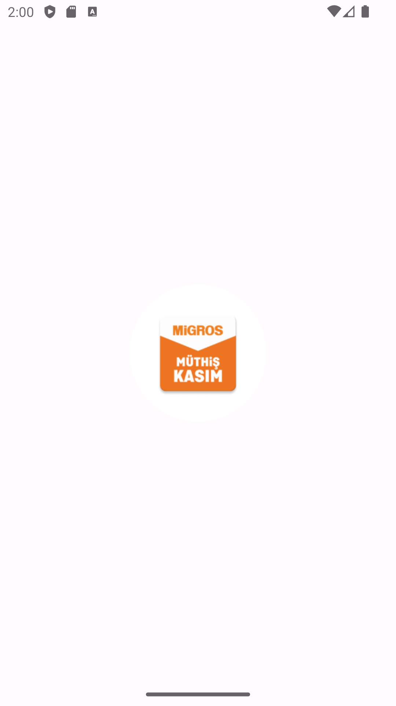

# Migros Uygulaması

## Açıklama
Bu proje, Migros alışveriş uygulamasının basit bir simulasyonunu içerir. Kullanıcılar, ürünleri listeleyebilir, sepetlerine ekleyebilir ve sipariş verebilirler.

## Ekran Görüntüleri

### Giriş Ekranı


### Ana Sayfa


## Kurulum
Projeyi çalıştırmak için aşağıdaki adımları takip edin:

1. Proje dosyalarını bilgisayarınıza indirin.
2. Terminal veya komut istemcisini açın ve proje dizinine gidin.
3. Aşağıdaki komutları kullanarak gerekli bağımlılıkları yükleyin:

   ```bash
   npm install
